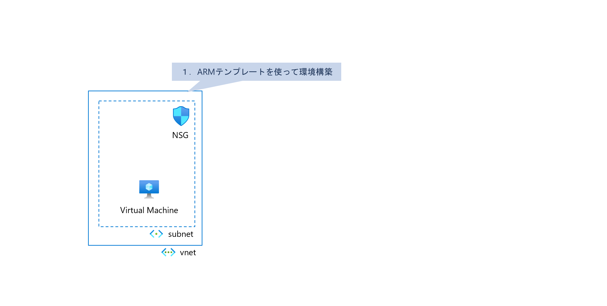

# Exercise0: 初期環境構築（ARMテンプレート）

## 【目次】

## Azureへリソースを展開

1. 以下のボタンからテンプレートを展開

    

    (*) "Deploy ボタン" からうまく飛べない場合、 以下のJSONファイルをダウンロードして「カスタムテンプレートのデプロイ」に読み込ませる

    [ARMテンプレート JSON ファイル](https://raw.githubusercontent.com/atsugoms/handson-azurestudy-05-monitor/main/infra/arm/deploy-resources.json)

1. Bastion が必要な場合

    Bastionが必要な場合、以下のテンプレートも展開し、 VNet Peering を作成

    

    [ARMテンプレート JSON ファイル](https://raw.githubusercontent.com/atsugoms/handson-azurestudy-05-monitor/main/infra/arm/deploy-vnet-hub.json)
