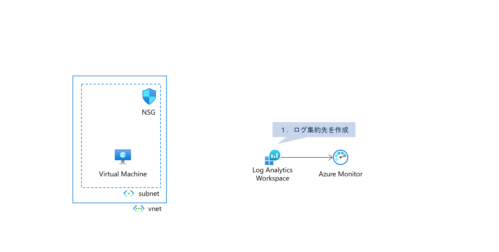
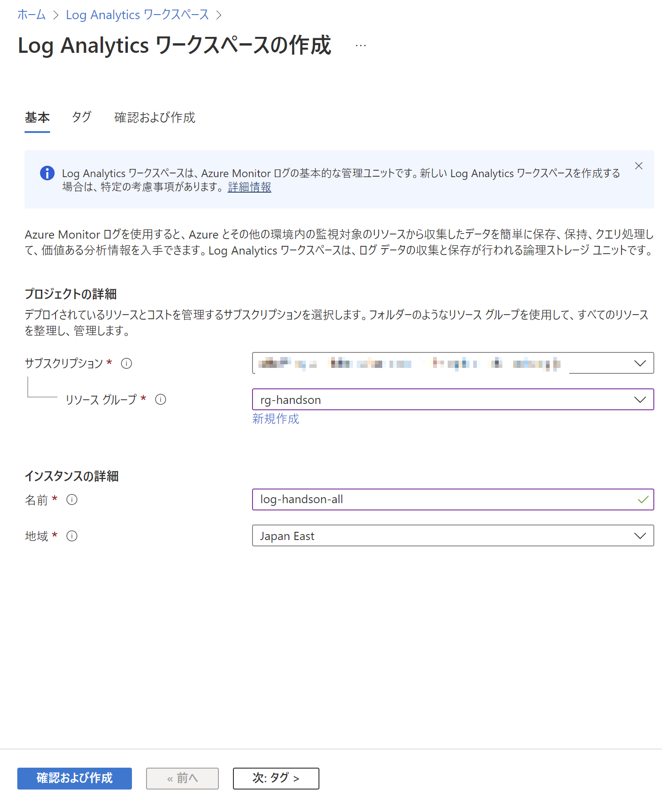
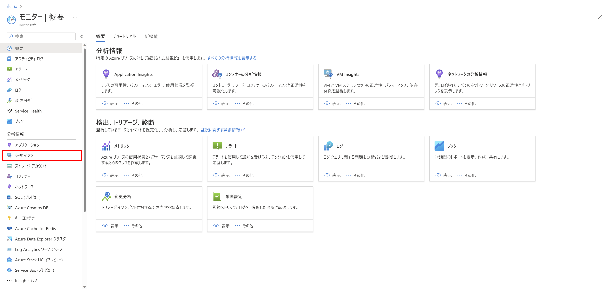
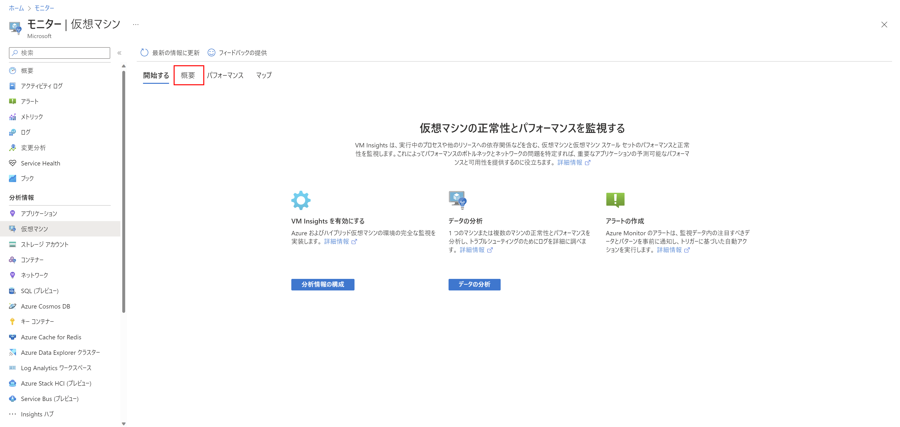
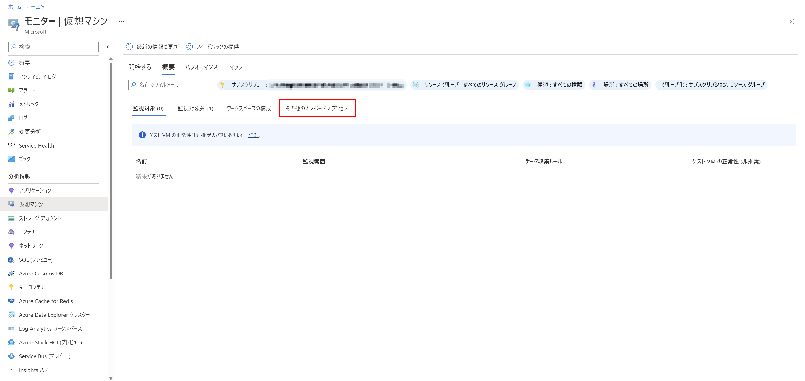
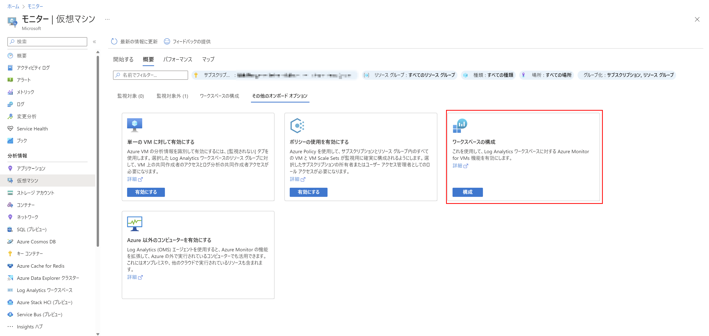
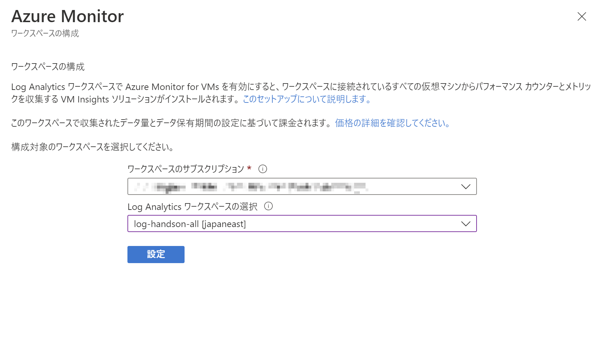

# Exercise1: Log Analytics Workspace 作成

### ⏳ 推定時間

- 1 ~ 2分

### 🗒️ 目次

1. [ログ集約先を作成](#ログ集約先を作成)
<!--
1. [仮想マシンのデフォルト保存先を設定](#仮想マシンのデフォルト保存先を設定)
-->

## ログ集約先を作成

1. Azureポータル上部の検索窓で「Log Analytics ワークスペース」を検索、開く

1. 一覧ページにある「作成」を選択

1. Log Analytics ワークスペース 作成

    1. 基本

        * サブスクリプション： (ハンズオン用に用意したもの)
        * リソースグループ： (事前準備で作成したもの)
        * 名前： (任意)
        * 地域： `Japan East`

        

    1. タグ

        特に指定なし

    1. 確認および作成

        内容を確認して「作成」

<!--
## 仮想マシンのデフォルト保存先を設定

1. Azureポータル上部の検索窓で「モニター」を検索、開く

1. [分析情報]-[仮想マシン] を開く

    

1. 「概要」タブへ移動

    

1. 「その他のオンボードオプション」を開く

    

1. 「ワークスペースの構成」を開く

    

1. 作成済みの Log Analytics ワークスペース を指定して「設定」

    
-->

# 次の Exercise へ

* [VM Insights 設定](exercise02.md)
