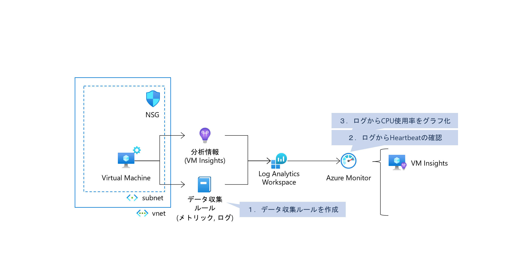
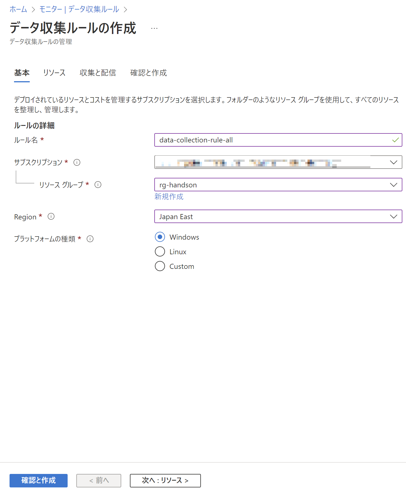
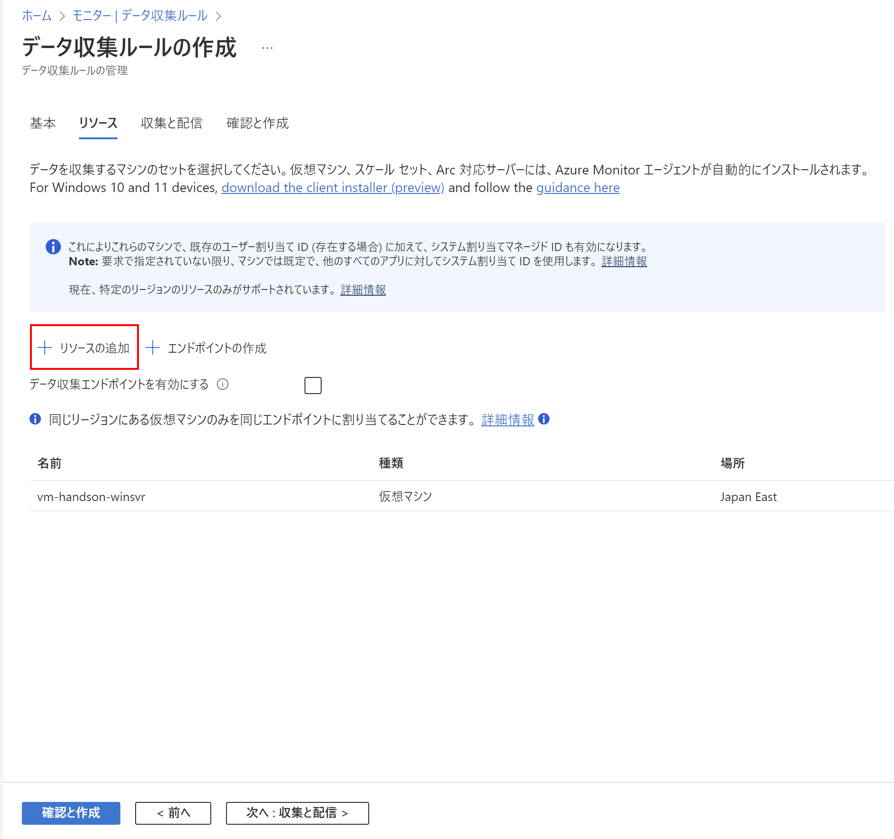
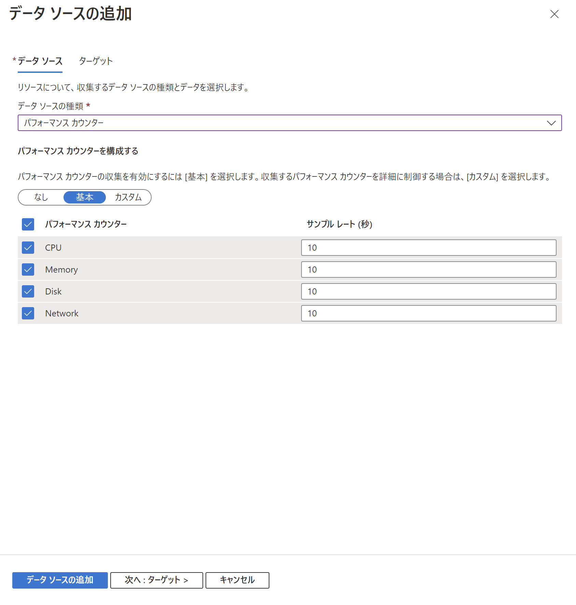
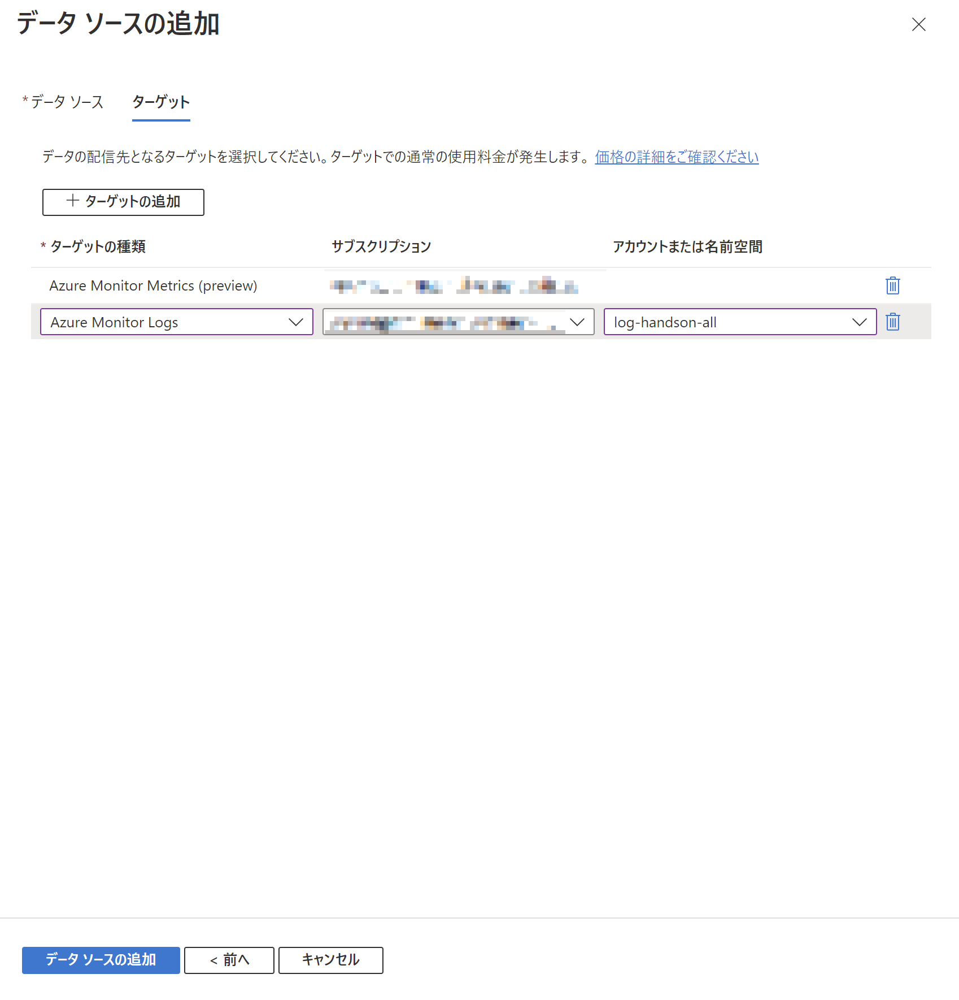
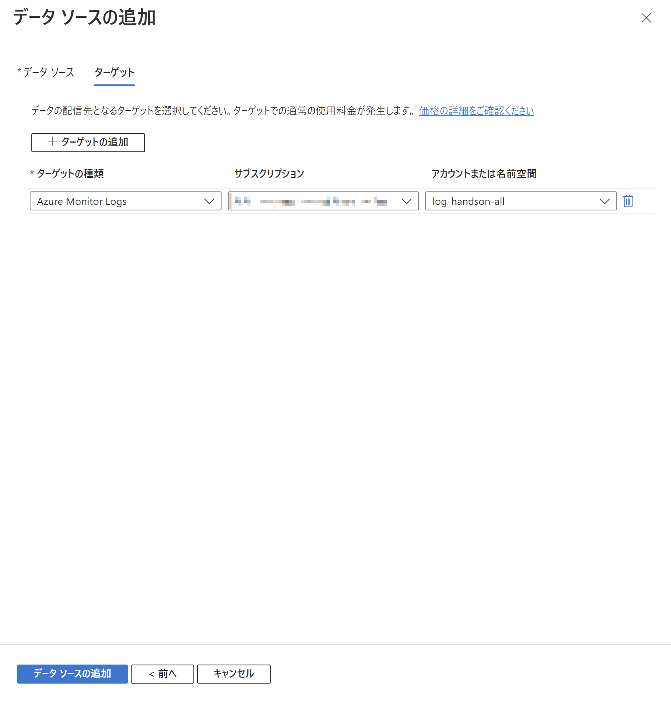
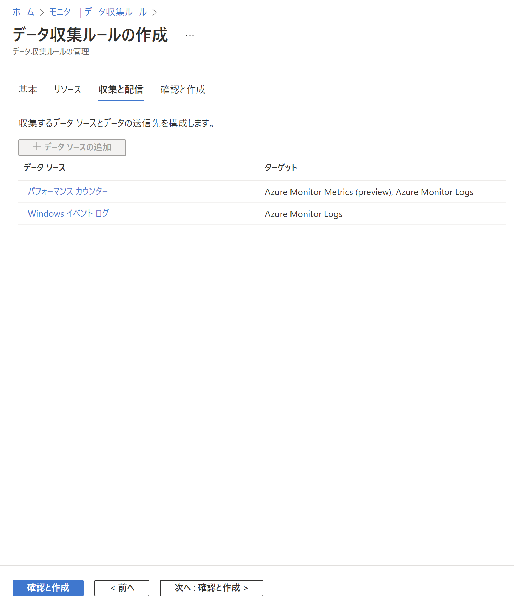
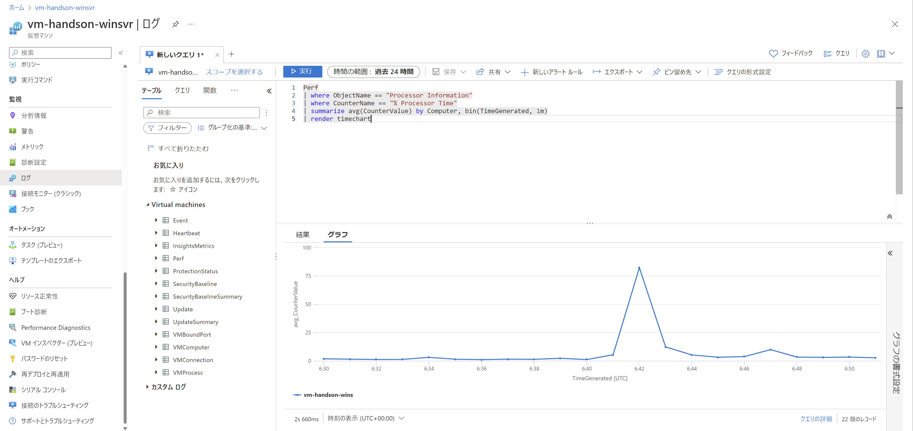

# Exercise3: 

## 【目次】

1. [データ収集ルールを作成](#データ収集ルールを作成)
1. [ログからHealthbeatの確認](#ログからhealthbeatの確認)
1. [ログからCPU使用率をグラフ化](#ログからcpu使用率をグラフ化)

## データ収集ルールを作成

1. Azureポータル上部の検索窓で「モニター」を検索、開く

1. [設定]-[データ収集ルール] を開く

1. 「作成」を選択

1. データ収集ルールの作成

    1. 基本

        * ルール名： (任意)
        * サブスクリプション： (ハンズオン用に用意したもの)
        * リソースグループ： (環境準備で作成したもの)
        * Region： `Japan East`
        * プラットフォーム： `Windows`

        

    1. リソース

        「リソースの追加」を選択して、環境準備で作成した仮想マシンを選択

        

    1. 収集と配信

        1. パフォーマンスカウンターの追加

            1. 「データソースの追加」を選択

            1. 「データソース」タブ
            
                * データソースの種類： `パフォーマンスカウンター`
                * その他： (デフォルトまま)

                

            1. 「ターゲット」タブ

                「ターゲットの追加」を選択して以下を追加

                * ターゲットの種類： `Azure Monitor Logs`
                * サブスクリプション： (ハンズオン用に用意したもの)
                * アカウントまたは名前空間： (作成済みの Log Analytics Workspace)

                

            1. 「データソースの追加」を選択してデータソースの追加

        1. Windowsイベントログの追加

            1. 「データソースの追加」を選択

            1. 「データソース」タブ
            
                * データソースの種類： `Windowsイベントログ`
                * アプリケーション： クリティカル、エラー、警告
                * セキュリティ： 監査の失敗
                * システム： クリティカル、エラー、警告

                

            1. 「ターゲット」タブ

                ログ保存先が作成済みの Log　Analytics Workspace になっていることを確認

                

            1. 「データソースの追加」を選択してデータソースの追加

        1. 「パフォーマンスカウンター」と「Windowsイベントログ」が追加された状態
        
            

    1. 確認と作成

        内容を確認して「作成」

(*) 以下のログ確認はデータ反映に時間がかかるため、
    確認して表示されていない場合、次の Excersise へ進んであとから確認する

## ログからHealthbeatの確認

1. Azureポータル上部の検索窓で「Virtual Machines」を検索、開く

1. 環境準備で作成した仮想マシンを開く

1. [監視]-[ログ] を開く

1. 以下の Kusto クエリ を実行して Heartbeat が実行されていることを確認

        Heartbeat
        | limit 100

    

## ログからCPU使用率をグラフ化

1. Azureポータル上部の検索窓で「Virtual Machines」を検索、開く

1. 環境準備で作成した仮想マシンを開く

1. [監視]-[ログ] を開く

1. 以下の Kusto クエリ を実行して CPU使用率がグラフ化されることを確認

        Perf
        | where ObjectName == "Processor Information"
        | where CounterName == "% Processor Time"
        | summarize avg(CounterValue) by Computer, bin(TimeGenerated, 1m)
        | render timechart

    

