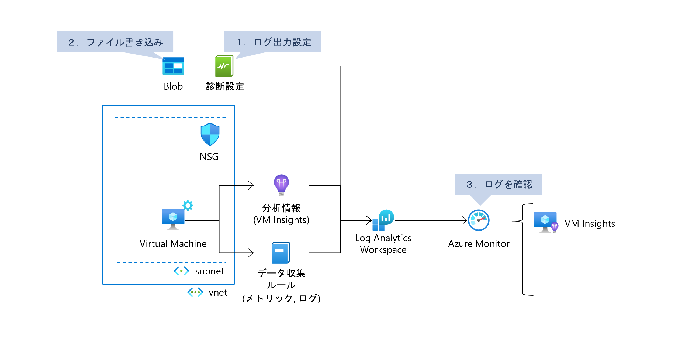
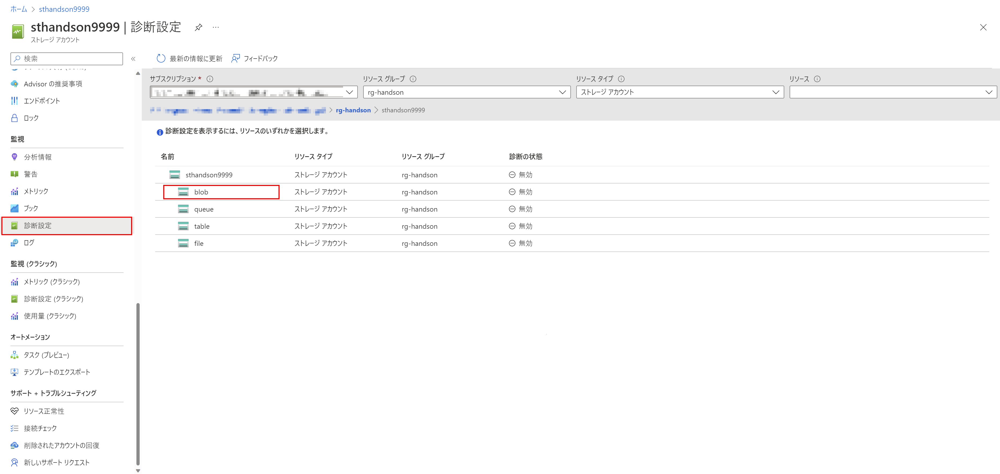
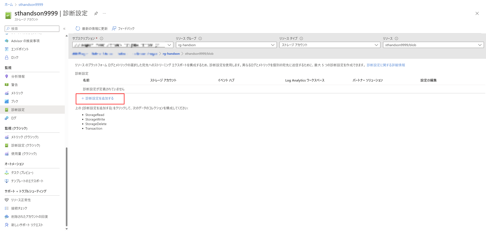
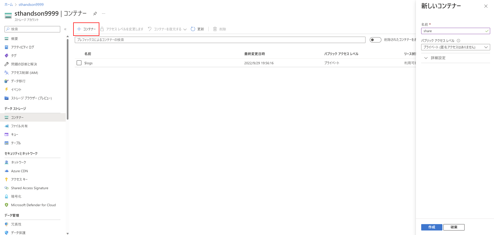
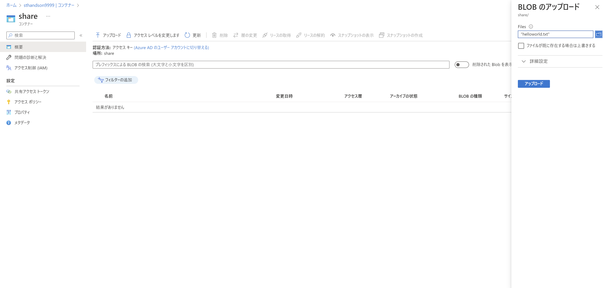
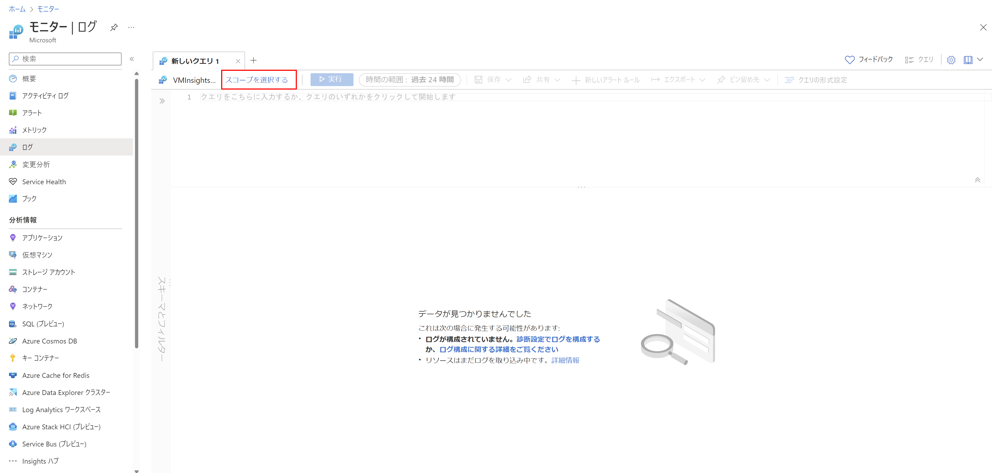
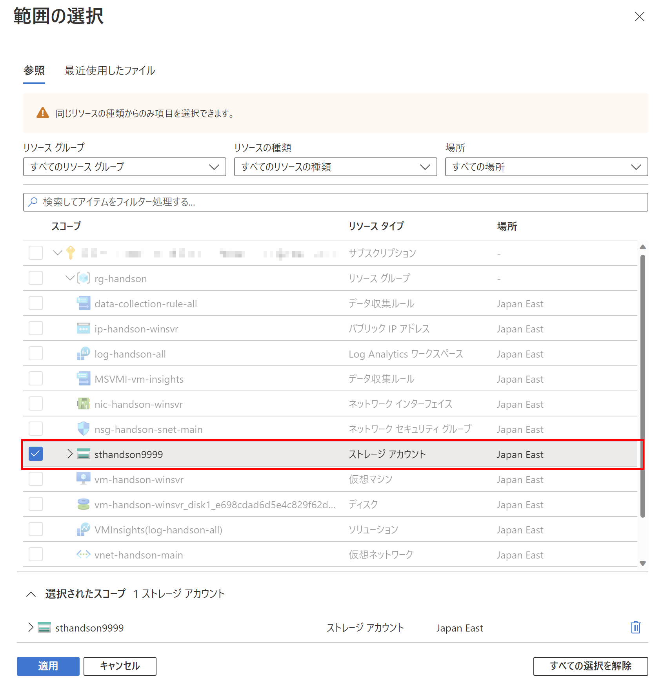
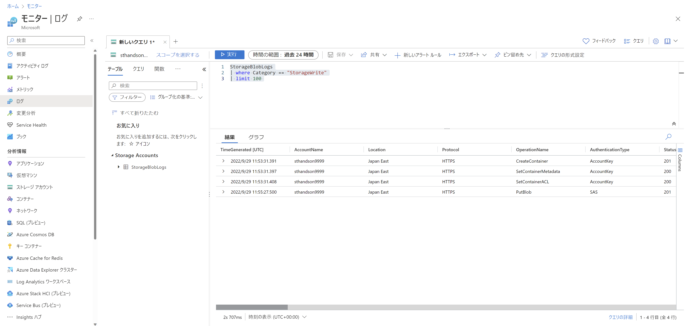

# Exercise4: Blob診断設定

### ⏳ 推定時間

- 3 ~ 5分

### 🗒️ 目次

1. [Blobのログ出力設定](#blobのログ出力設定)
2. [ファイル書き込み](#ファイル書き込み)
3. [Monitorでログを確認](#monitorでログを確認)

## Blobのログ出力設定

1. Azureポータル上部の検索窓で「ストレージアカウント」を検索、開く

1. 一覧から環境構築時に作成したストレージアカウントを探して開く

1. [監視]-[診断設定] を開き、Blob を選択

    

1. 「診断設定を追加する」を選択

    

1. 診断設定を設定して「保存」

    * ログ： `StorageRead`, `StorageWrite`, `StorageDelete`
    * 宛先の詳細： `Log Analytics ワークスペースへの送信` をチェックして 作成済みの Log Analytics ワークスペースを指定

    

## ファイル書き込み

アクセス権の追加

1. [アクセス制御(IAM)] を開き、「ロールの割り当ての追加」を選択

1. ロールの割り当ての追加

    1. ロール

        - 職務ロール: `ストレージ BLOB データ共同作成者`
    
    1. メンバー

        - アクセスの割当先: `ユーザー、グループ、またはサービス プリンシパル`
        - メンバー: (自分自身)
    
    1. 条件

        （デフォルトまま）
    
    1. レビューと割り当て

        内容を確認して「レビューと割り当て」

ファイルの書き込み

1. [データストレージ]-[コンテナー] へ移動

1. 「コンテナー」を選択して「新しいコンテナー」を作成

    * 名前： `share`
    * パブリックアクセスレベル： `プライベート`

    

1. 作成したコンテナーに入り、適当なファイルをアップロード

    

## Monitorでログを確認

1. Azureポータル上部の検索窓で「モニター」を検索、開く

1. [ログ]を開く

1. 「スコープを選択する」を開き、ストレージアカウントを選択

    

1. 範囲の選択にてストレージアカウントを選択して「適用」を押下

    

1. 以下のクエリを実行して Blob への書き込みログを確認

        StorageBlobLogs
        | where Category == "StorageWrite"
        | limit 100

    

# 次の Exercise へ

* [NSG フローログ](exercise05.md)
