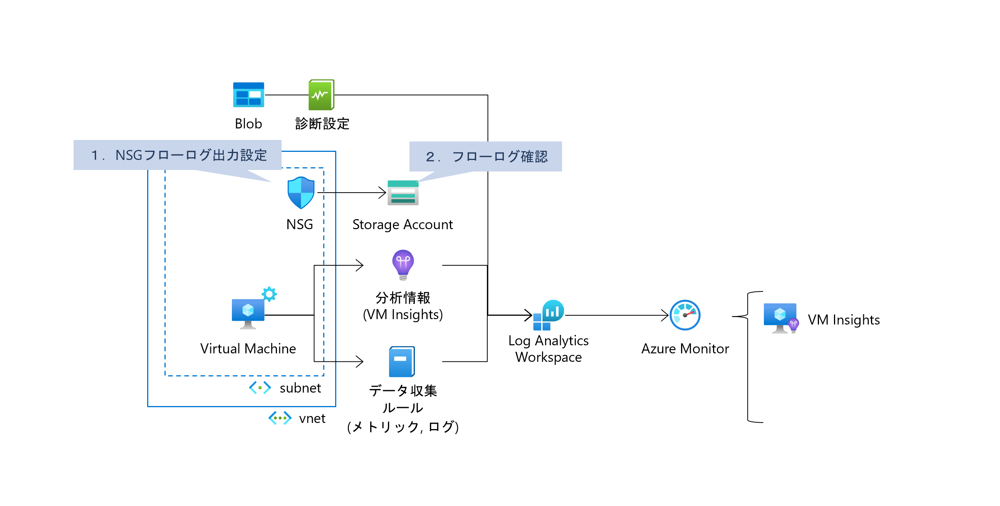
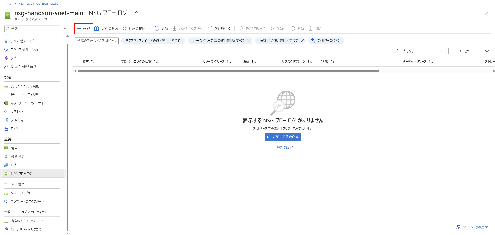
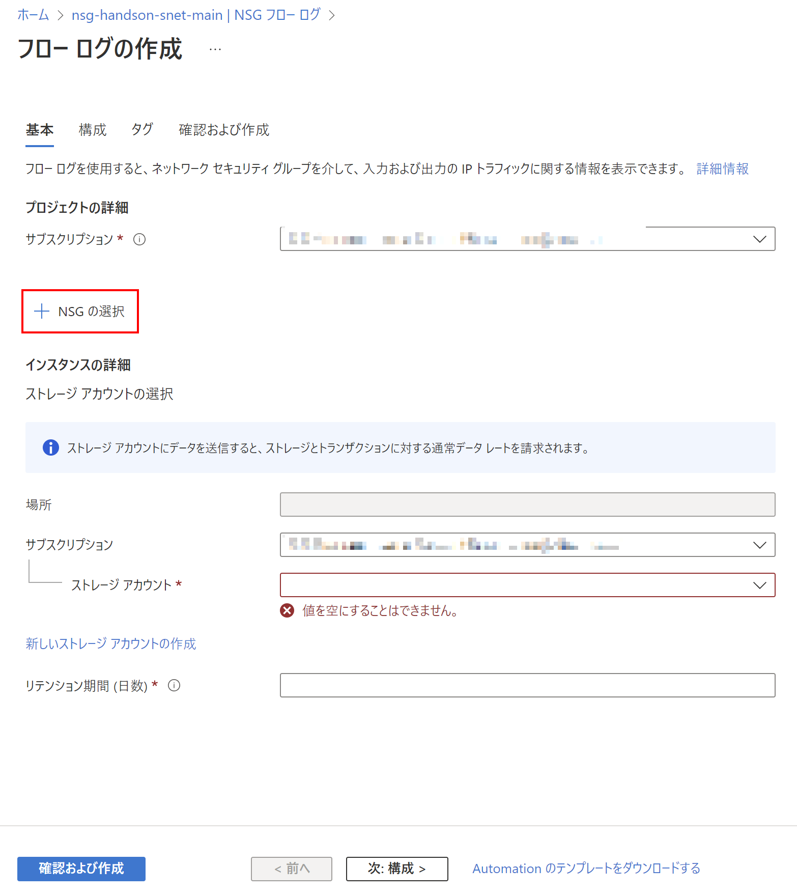
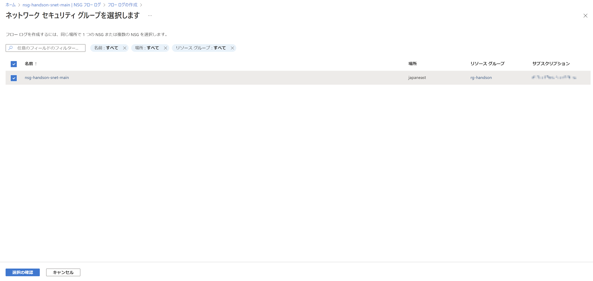
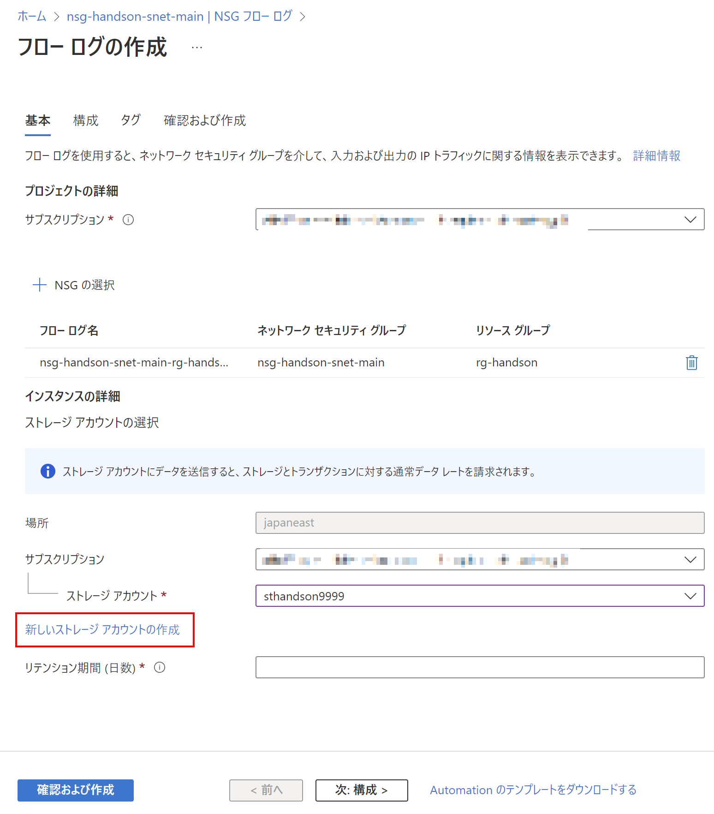
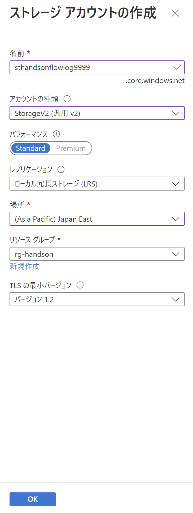
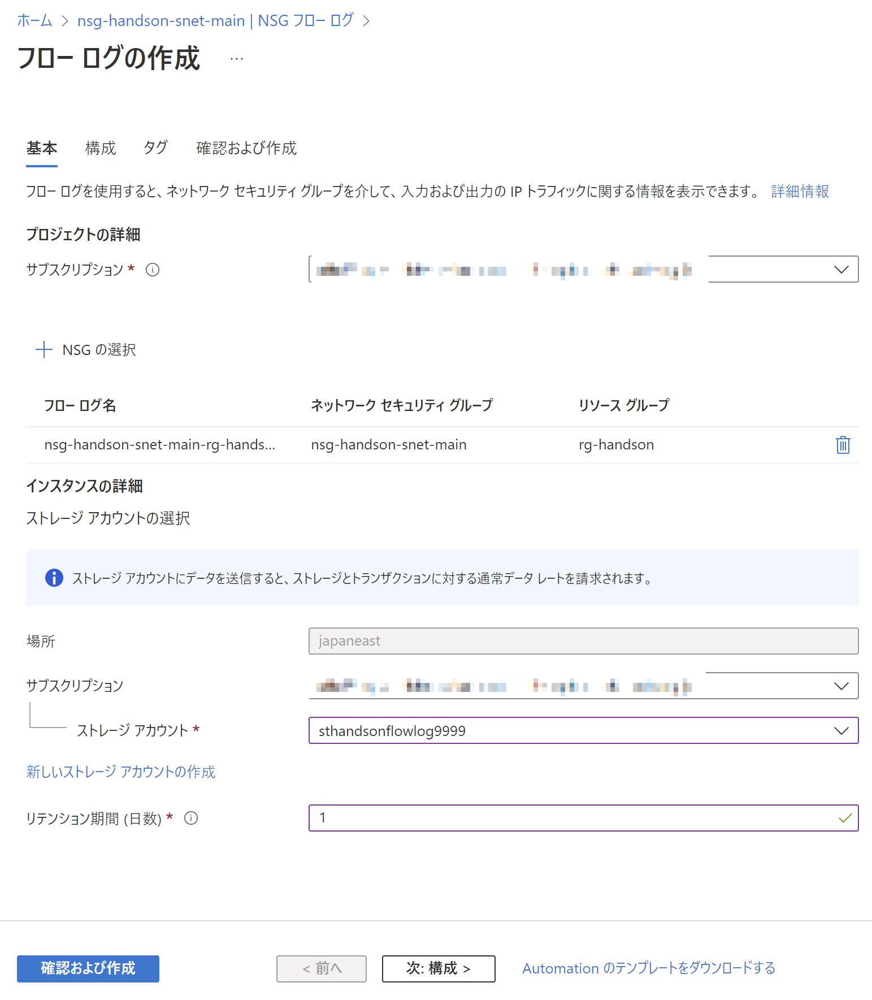
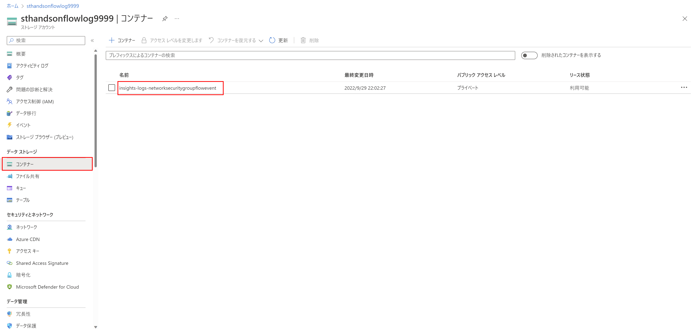
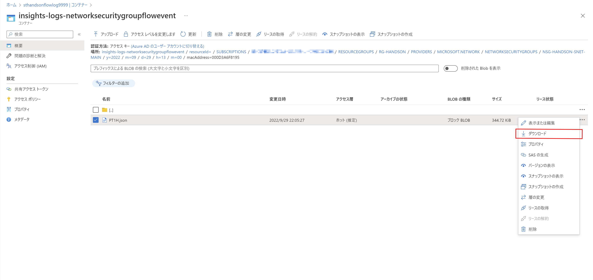
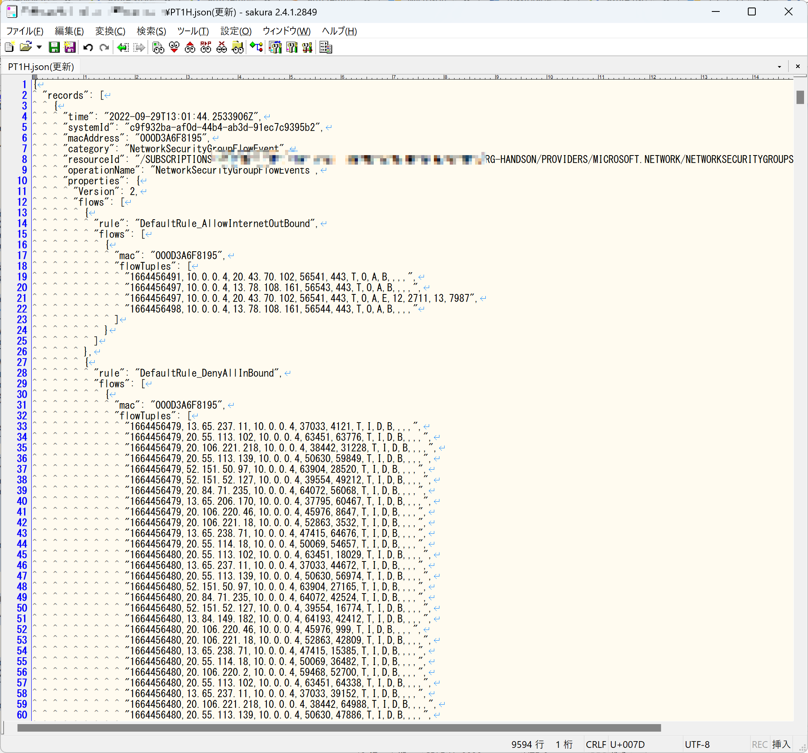

# Exercise5: NSGフローログ設定

### ⏳ 推定時間

- 5 ~ 8分

### 🗒️ 目次

1. [NSGフローログ出力設定](#nsgフローログ出力設定)
1. [フローログ確認](#フローログ確認)

## NSGフローログ出力設定

1. Azureポータル上部の検索窓で「ネットワークセキュリティグループ」を検索、開く

1. 一覧から環境構築時に作成したネットワークセキュリティグループを選択

1. [監視]-[NSGフローログ]を開き、「作成」を選択

    

1. フローログの作成

    1. 基本

        1. 「NSGの選択」を選択

            

        1. ネットワークセキュリティグループを選択

            作成済みのNSGを選択して、「選択の確認」

            

        1. 「新しいストレージアカウントの作成」を選択

            

        1. ストレージアカウントの作成で以下を設定して「OK」

            * 名前： (任意)
            * アカウントの種類： `StorageV2`
            * パフォーマンス： `Standard`
            * レプリケーション： `ローカル冗長ストレージ(LRS)`
            * 場所： `Japan East`
            * リソースグループ： (環境構築時に作成したもの)

            

        1. リテンション期間に任意数値を入れる

            

    1. 分析、タグ

        特に指定なし。

    1. 確認および作成

        内容を確認して「作成」

## フローログ確認

1. フローログ保管用に作成した ストレージアカウント を開く

1. [データストレージ]-[コンテナー]を開き、 `insights-logs-networksecuritygroupflowevent` コンテナーを開く

    

1. フォルダーを掘って末端にある `PT1H.json` を探し出し、ダウンロードする

    

1. ダウンロードした `PT1H.json` の中身を確認

    * キャプチャはJSONを整形し直したもの
    * フローログのJSONに関する説明は [ログの形式](https://learn.microsoft.com/ja-jp/azure/network-watcher/network-watcher-nsg-flow-logging-overview#log-format) を参照

    

# 次の Exercise へ

* [アラートルール](exercise06.md)
