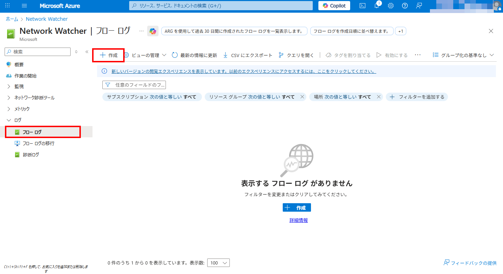
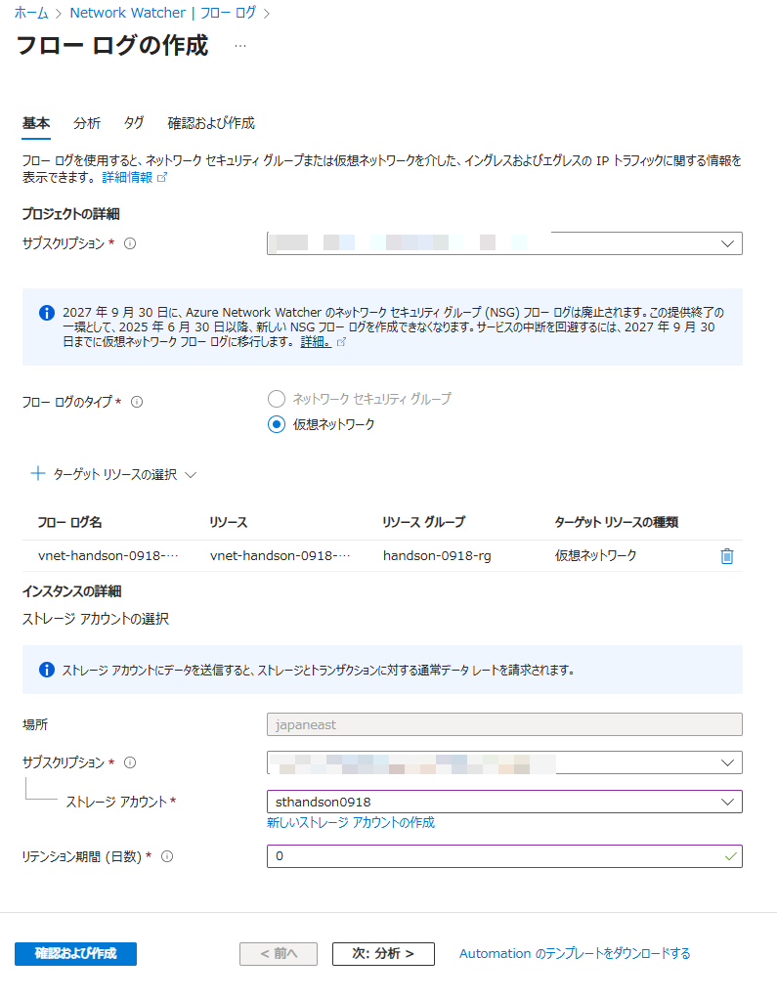
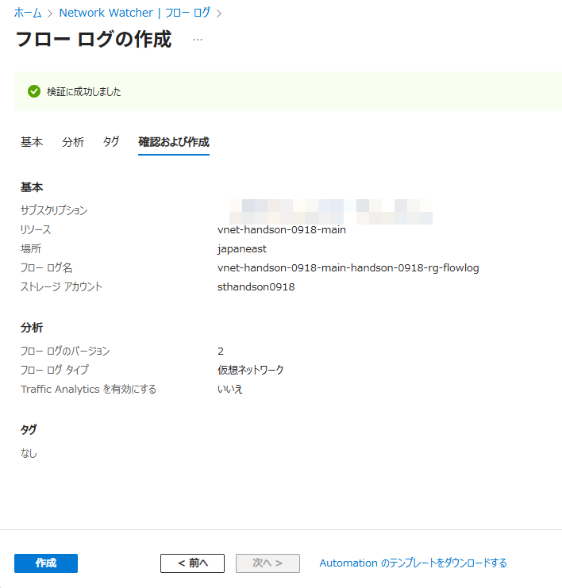
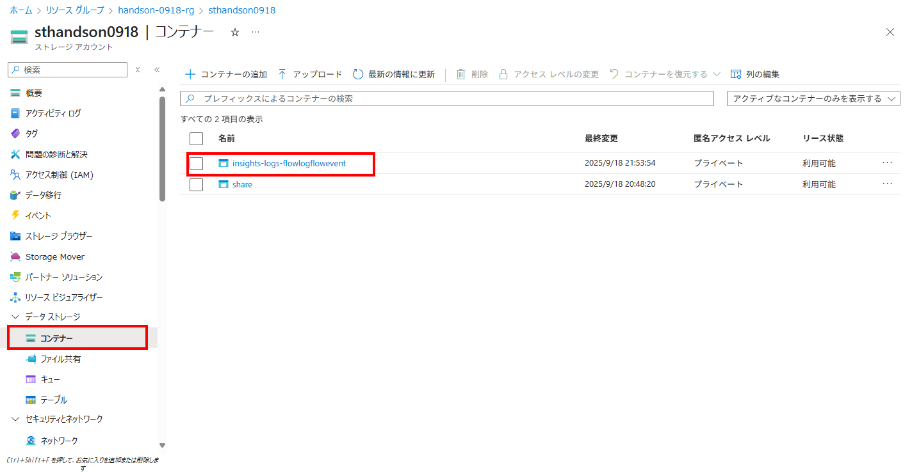
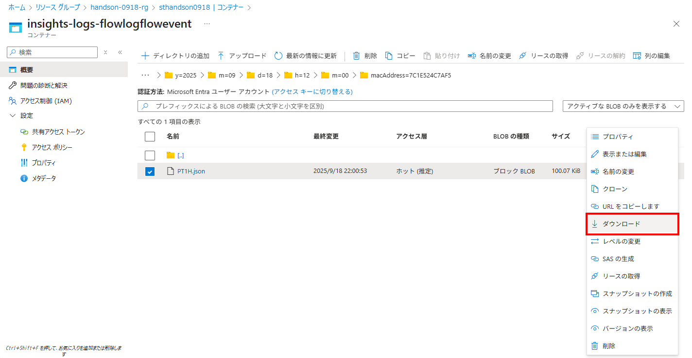
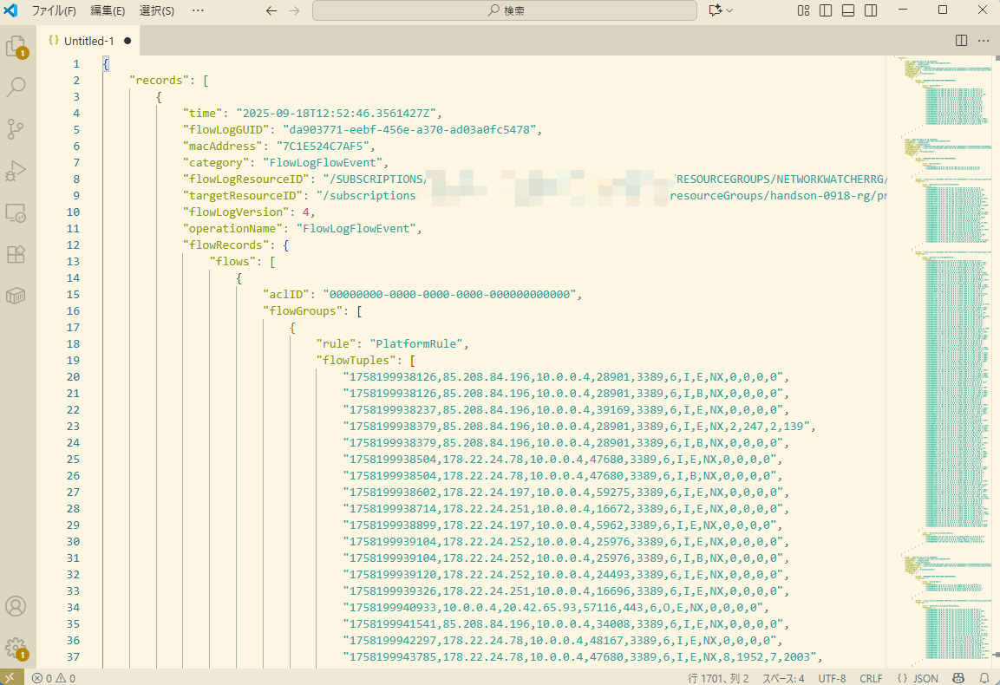

# Exercise5: VNetフローログ設定

### ⏳ 推定時間

- 5 ~ 8分

### 🗒️ 目次

1. [VNetフローログ出力設定](#vnetフローログ出力設定)
1. [フローログ確認](#フローログ確認)

## VNetフローログ出力設定

1. Azureポータル上部の検索窓で「Network Watcher」を検索、開く

1. [ログ]-[フローログ] を開き、「作成」を選択

    

1. フローログの作成

    1. 基本

        - サブスクリプション: (ハンズオン用のもの)
        - フローログのタイプ: `仮想ネットワーク`
        - ターゲットリソースの選択: `仮想ネットワーク` を選択、作成済み仮想ネットワークを選択
        - ストレージアカウント: (作成済みのもの)
        - リテンション機関: `0`

        
    
    1. 分析 ~ タグ

        指定なし

    1. 確認および作成

        内容を確認して「作成」

        

## フローログ確認

1. フローログ保管用に作成した ストレージアカウント を開く

1. [データストレージ]-[コンテナー]を開き、 `insights-logs-flowlogflowevent` コンテナーを開く

    

1. フォルダーを掘って末端にある `PT1H.json` を探し出し、ダウンロードする

    

1. ダウンロードした `PT1H.json` の中身を確認

    * キャプチャはJSONを整形し直したもの  
        Visual Studio Code にて `Shift + Alt + F` でJSONフォーマット
    * フローログのJSONに関する説明は [ログの形式](https://learn.microsoft.com/ja-jp/azure/network-watcher/network-watcher-nsg-flow-logging-overview#log-format) を参照

    

# 次の Exercise へ

* [アラートルール](exercise06.md)
