# Exercise6: アラートルール作成

## 【目次】

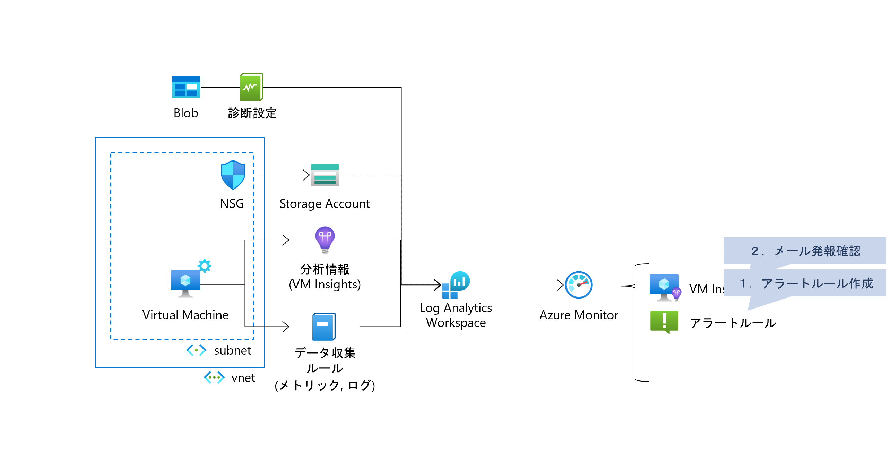

1. [アラートルール作成](#アラートルール作成)
1. [アラートの動作確認](#アラートの動作確認)

## アラートルール作成

1. Azureポータル上部の検索窓で「モニター」を検索、開く

1. [アラート]を開き、[作成]-[アラートルール]を選択

    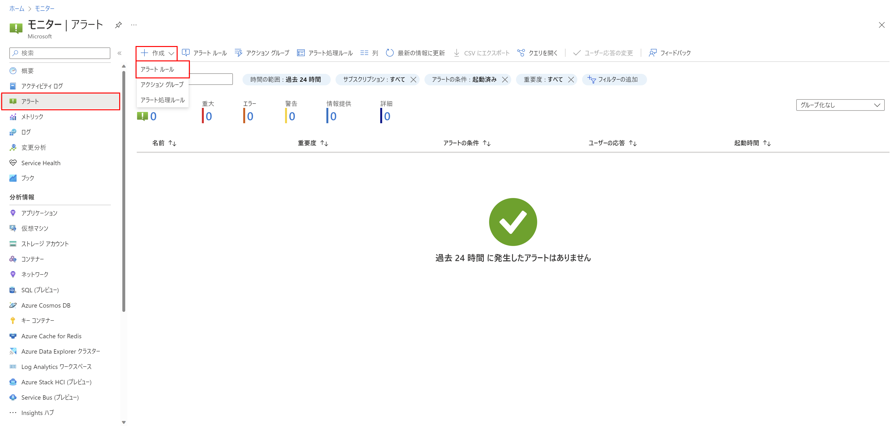

1. アラートルールの作成
    
    1. スコープ
    
        `Log Analytics ワークスペース` に絞って環境構築済み Log Analytics ワークスペース を選択、完了

        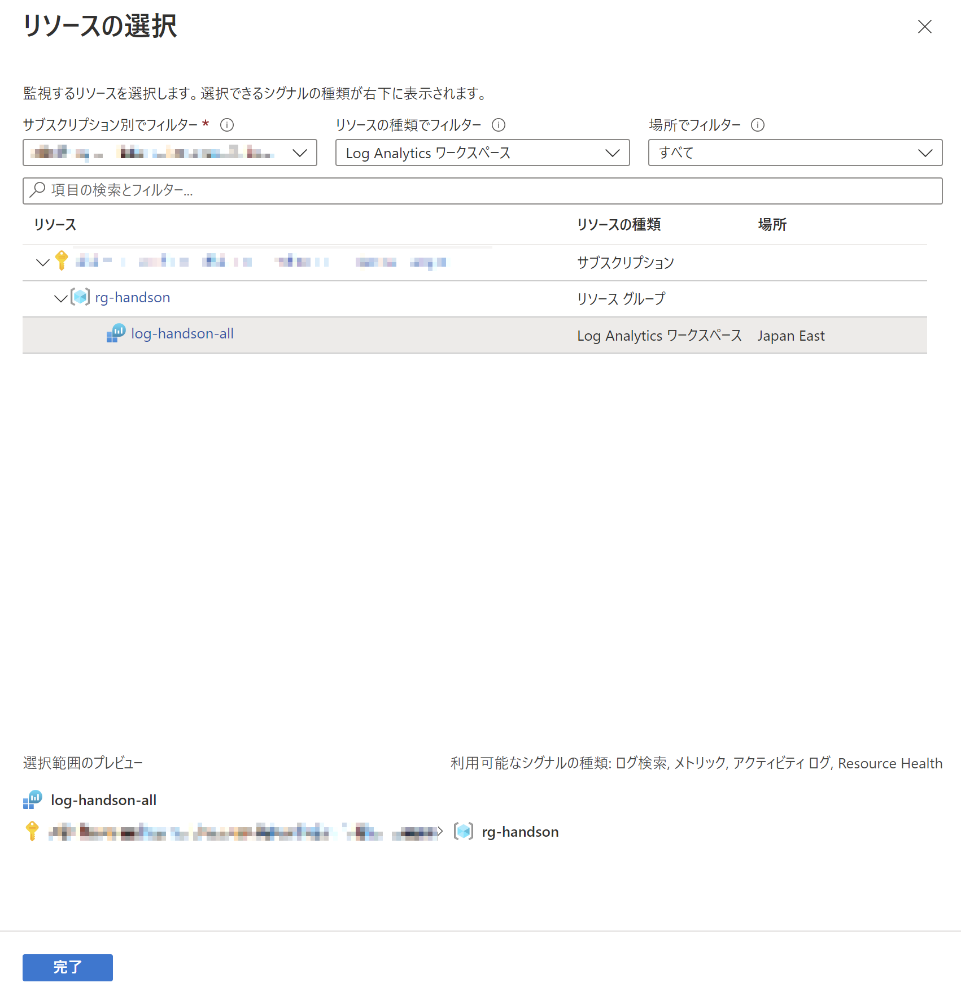

    1. 条件

        「シグナルの選択」にて、メトリックの `% Processor Time` を選択

        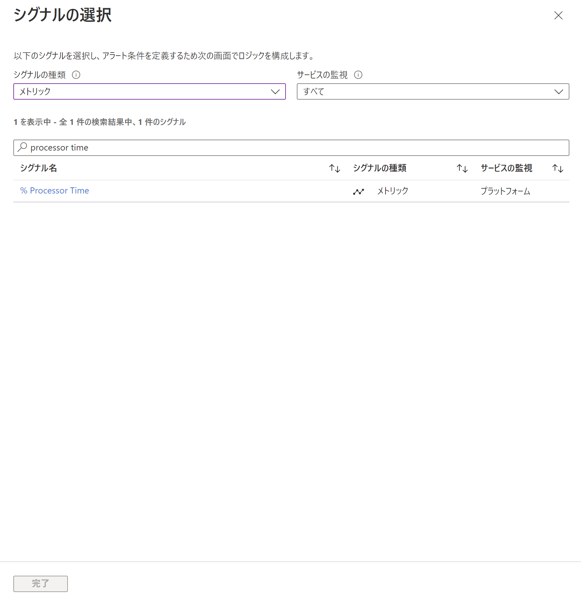

        以下の条件を設定

        * ディメンション
            * ディメンション： `Computer`
            * 演算子： `=`
            * ディメンション値： (作成済の仮想マシン)
        * アラートロジック
            * しきい値： `Static`
            * 集計の種類： `平均`
            * 演算子： `次の値より大きい`
            * 単位： `カウント`
            * しきい値： `60`
            * 確認する間隔： `1分`
            * 次の時間分の過去データを参照： `5分`

        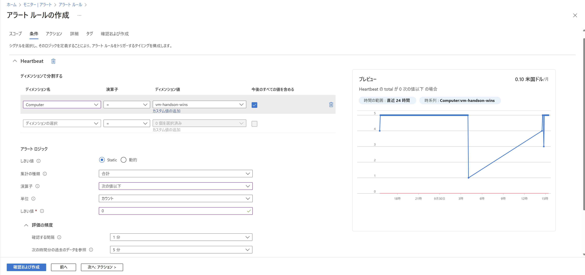

    1. アクション

        1. 「アクショングループの作成」を選択

            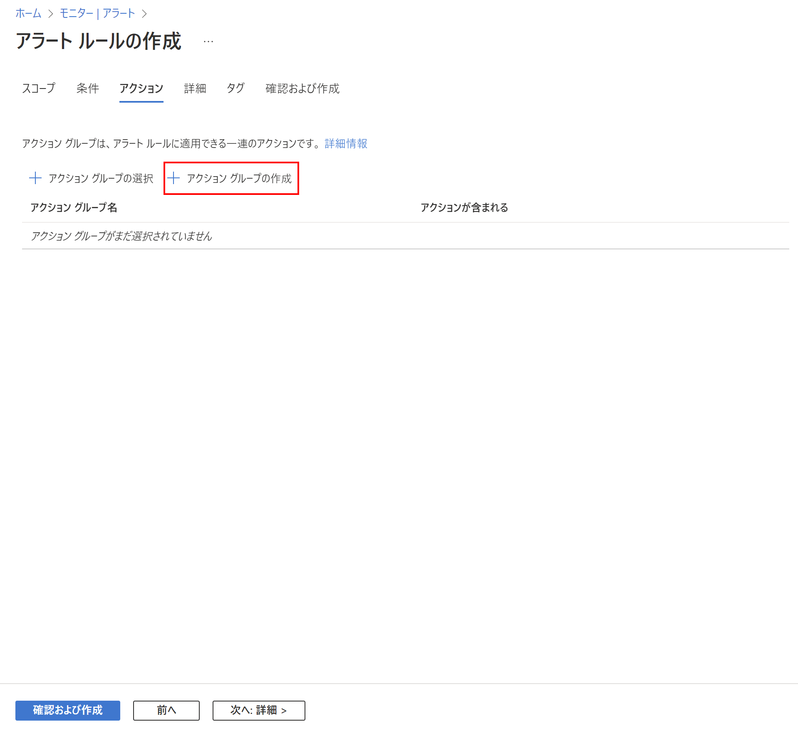

        1. 「基本」ページにて以下を設定

            * リソースグループ： (環境準備で作成したもの)
            * リージョン： `Global`
            * アクショングループ名： (任意)
            * 表示名： (任意)

            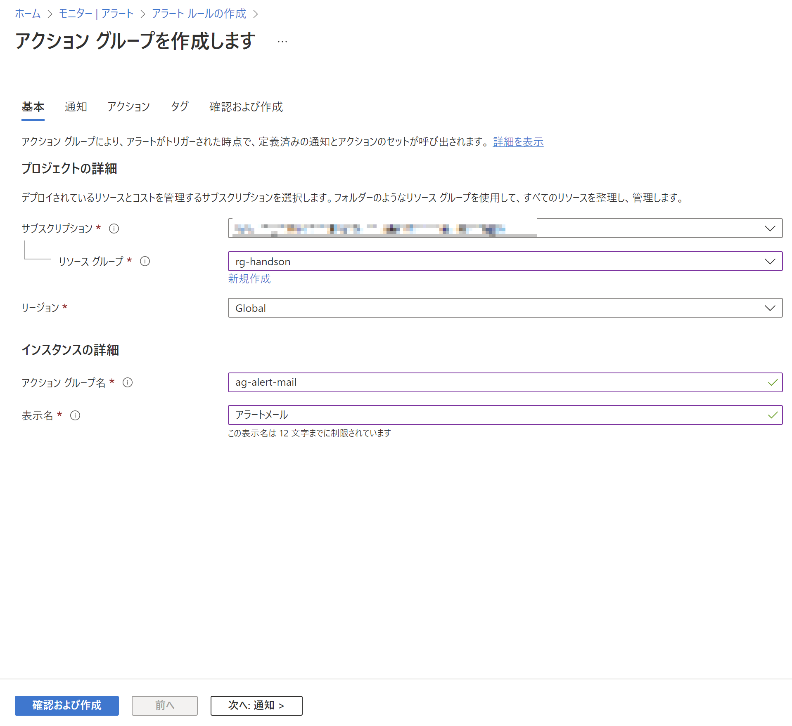

        1. 「通知」ページにて以下を設定

            * 通知の種類： `電子メール/SMS メッセージ/プッシュ/音声`
            * 名前： (任意)

            * 電子メール： `有効` にして `電子メール` に送信先を設定

            (※) 正しくメール設定できていればアクショングループへ登録された旨のメールが飛ぶ

            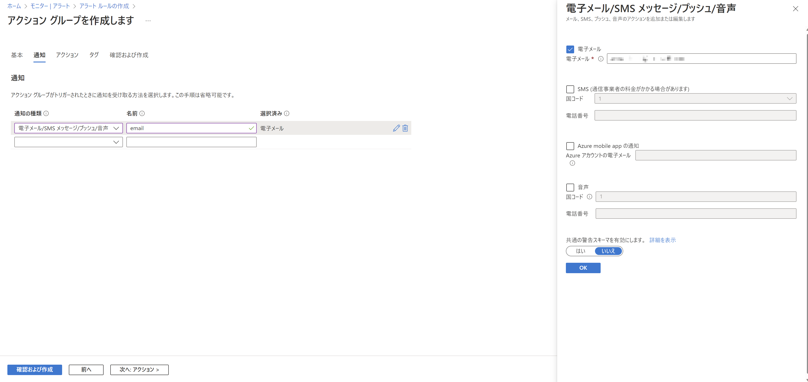

        1. アクション、タグ

            特に指定なし

        1. 確認および作成

            内容を確認して「作成」

    1. 詳細

        * リソースグループ：  (環境準備で作成したもの)
        * 重大度： (任意)
        * アラートルール名： (任意)

        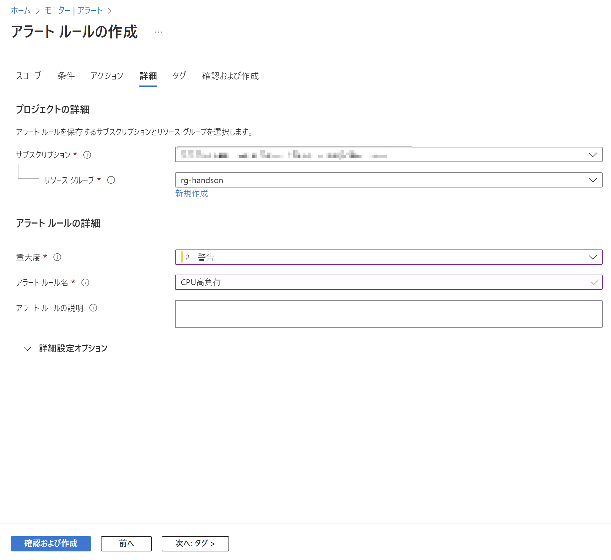

    1. タグ

        特に指定なし

    1. 確認および作成

        内容を確認して「作成」

## アラートの動作確認

1. 仮想マシンにRDP接続して PowerShell で以下のコマンドを実行

        while ($i -ne 0) { echo $i; $i++ }

    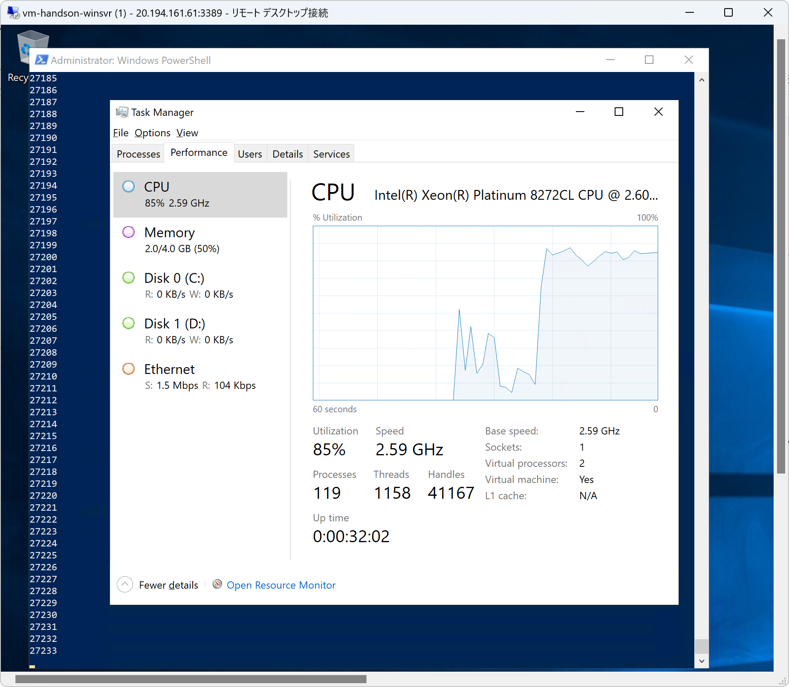

1. アラートメールが飛んでくることを確認

    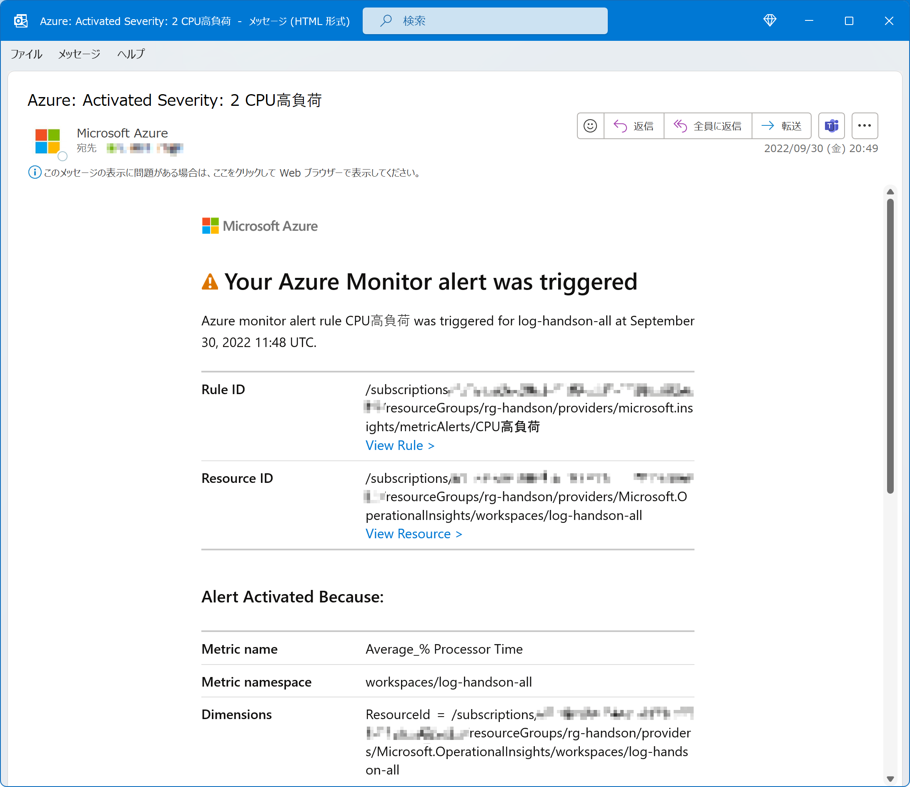

1. **メールが確認できたら仮想マシンで実行している PowerShell をそのまま閉じて止める**

    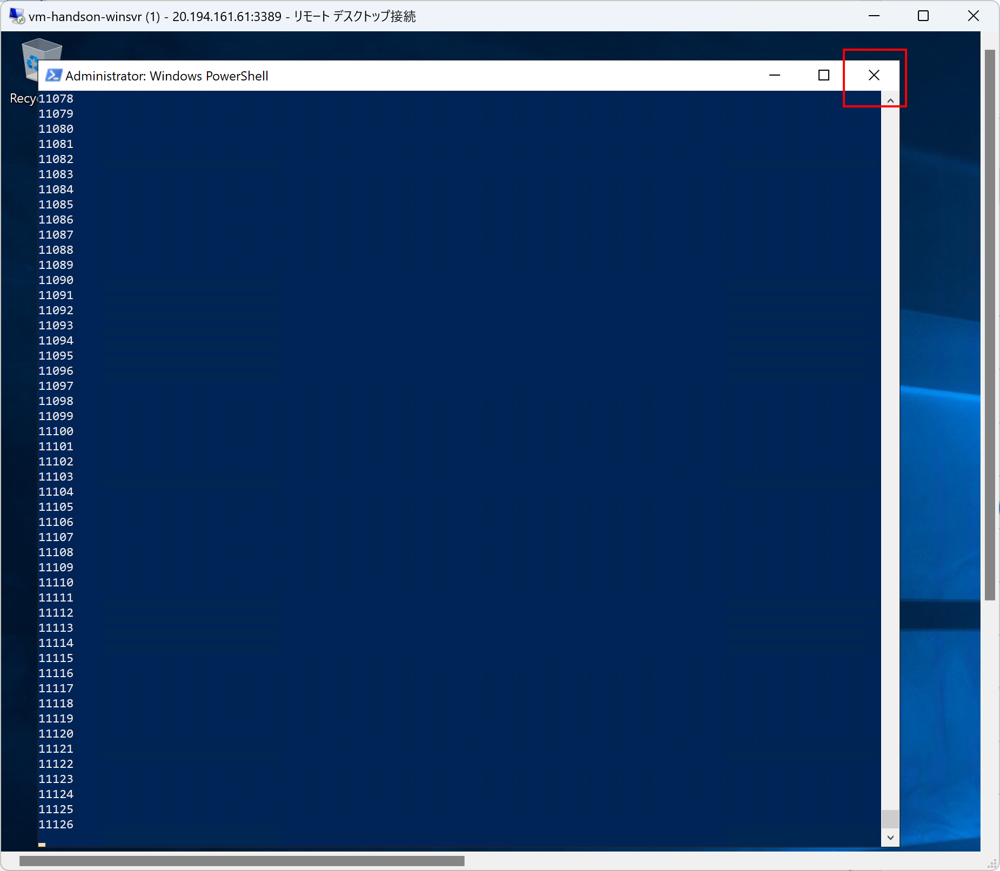

# 次の Exercise へ

* [Workbook](exercise07.md)
