# Exercise7: Workbook作成

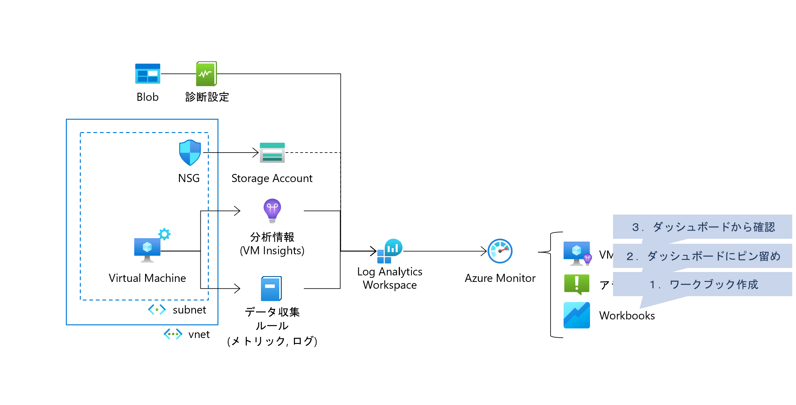

### ⏳ 推定時間

- 5 ~ 8分

### 🗒️ 目次

1. [ワークブックを確認](#ワークブックを作成)
1. [ダッシュボードにピン留め](#ダッシュボードにピン留め)
1. [ダッシュボードから確認](#ダッシュボードから確認)

## ワークブックを作成

1. Azure モニターを開く

1. [ブック]を開き、「新規」を選択

    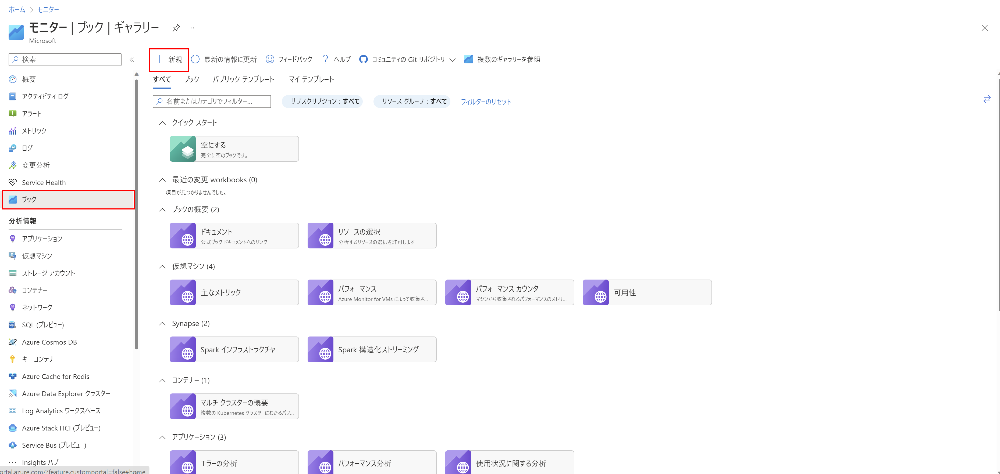

1. [追加]-[メトリックの追加]を選択

    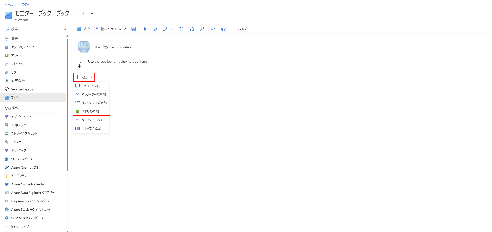

1. 以下の設定でCPUメトリックを表示

    1. 対象の指定

        * リソースの種類： `仮想マシン`
        * メトリックスコープ： `サブスクリプション`
        * サブスクリプション： (ハンズオン用に用意したもの)
        * 場所： `すべて`
        * 時間の範囲： `過去24時間`

        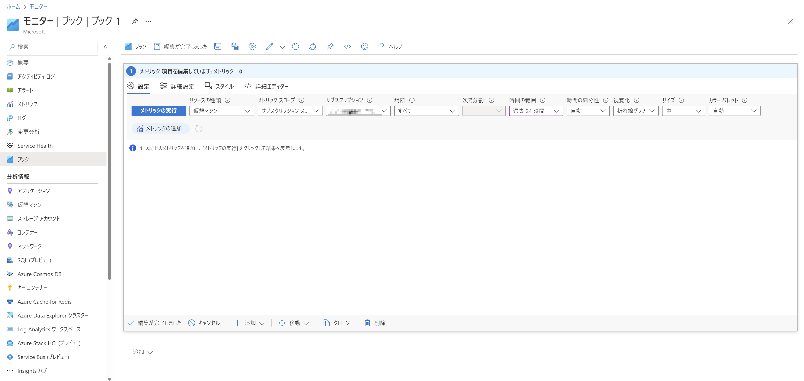

    1. メトリックの追加

        設定ができたら「メトリックの追加」を押下して以下を設定して「保存」

        * 名前空間： `仮想マシンホスト`
        * メトリック： `Percentage CPU`
        * 集計： `平均`
        * 表示名： (任意)

        メトリックを選択すると分割が選べるようになるので以下のように選択

        * 次で分割： `リソースID`

        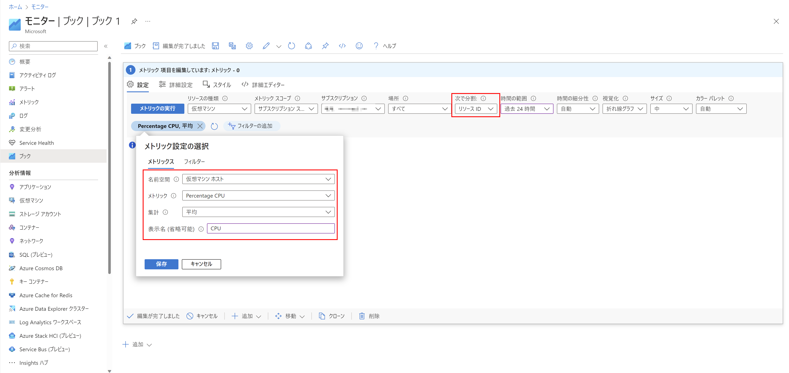

    1. 「メトリックの実行」を押下してグラフを確認

        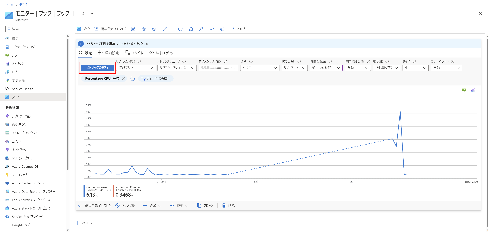

    1. 「編集が完了しました」を押下して保存

1. 「保存」を押下してブックを保存

    * タイトル： (任意)
    * サブスクリプション： (ハンズオン用に用意したもの)
    * リソースグループ： (ハンズオン用に用意したもの)
    * 場所： `Japan East`

    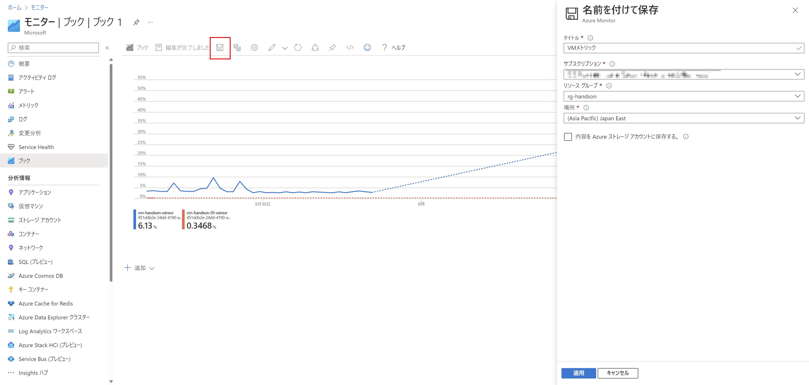

## ダッシュボードにピン留め

1. 「ピン止めオプションを表示」を選択

    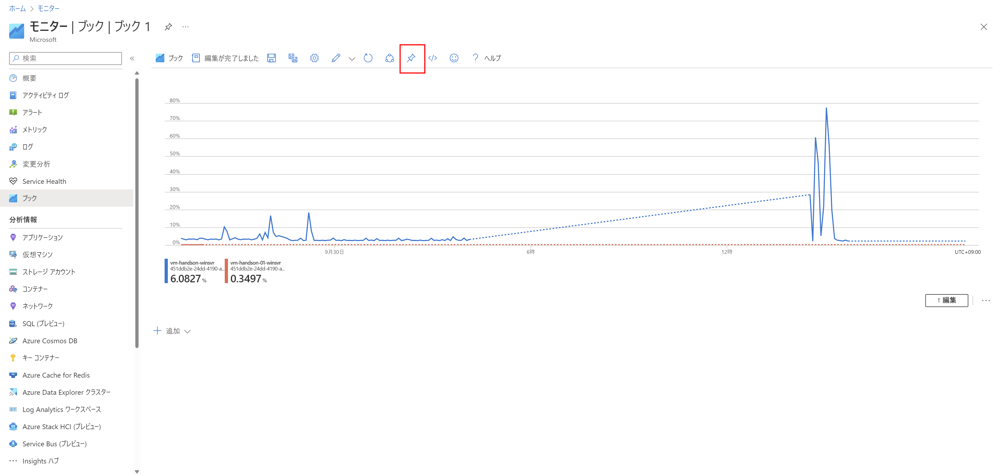

1. 「ブックをピン留めする」を選択

    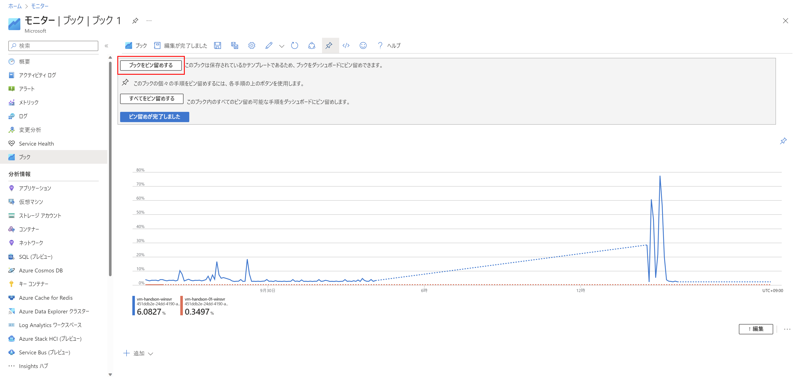

1. ダッシュボードにピン留め

    「新規作成」タブへ移動し、以下を設定、「作成してピン留めする」

    * 種類： `共有済み`
    * ダッシュボード名： (任意。重複しないよう注意)
    * サブスクリプション： (ハンズオン用に用意したもの)
    * `dashboards` リソースグループに発行： `無効` 
    * リソースグループ： (ハンズオン用に用意したもの)

    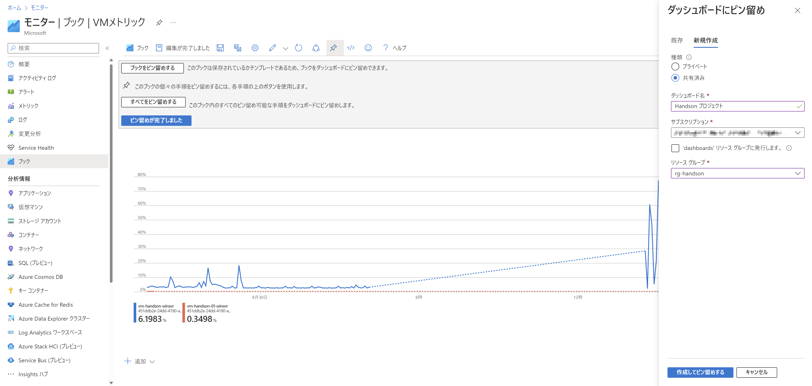

## ダッシュボードから確認

1. Azure ポータルの左メニューを展開して「ダッシュボード」を選択

    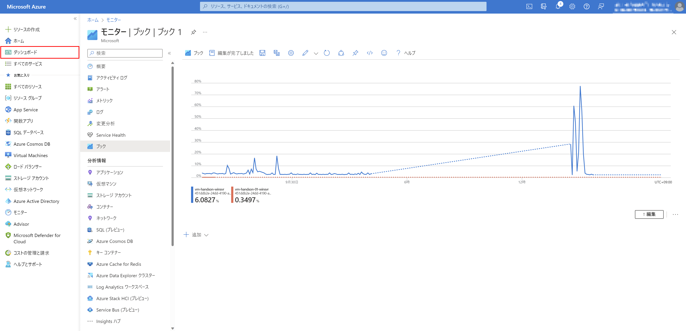

1. 「マイダッシュボード」を開いて作成したダッシュボードを選択

    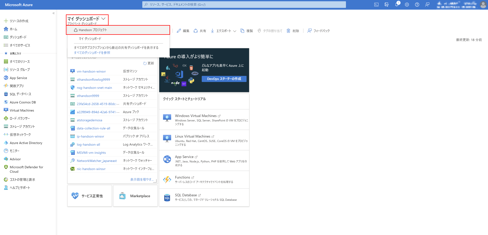

1. 作成したブックを選択

    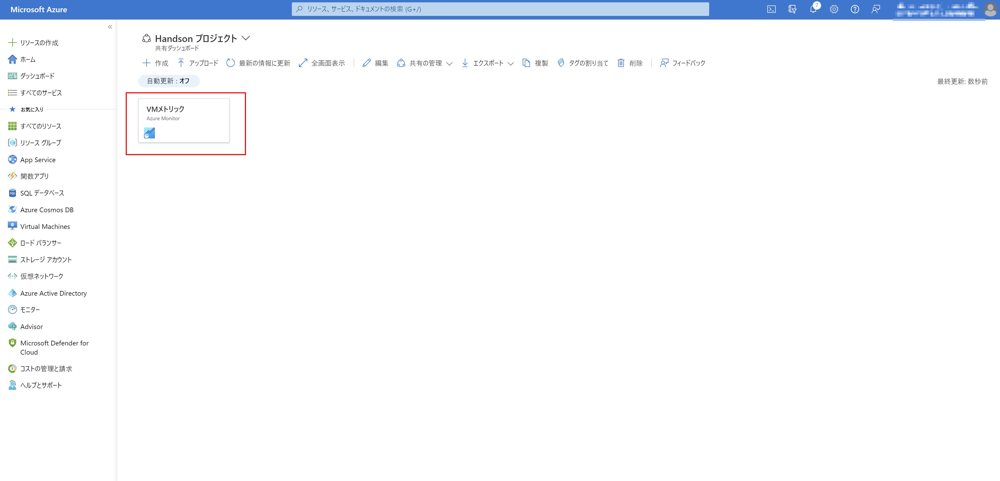

1. 作成したメトリックを確認

    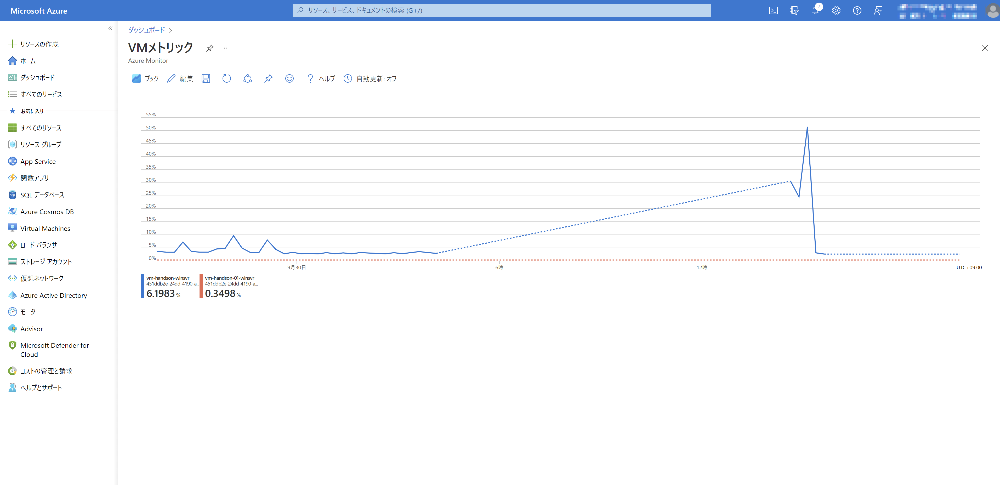

# すべて完了 🎉

不要なリソースグループは削除して終わりになります。

* [クリーンアップ](exercise99.md)

